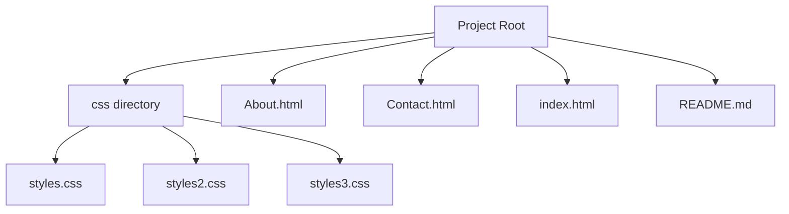

# Disha Website

A minimal static website built with plain HTML and CSS. This project provides a simple homepage and supporting pages (About and Contact) with styling located in the css directory.

## Architecture Overview

## Tech Stack

- HTML
- CSS
- Static web pages (no frameworks or build tooling detected)

No configuration files or automation scripts are included in this repository.

## Getting Started / How to Run

This repository is a static site consisting of HTML and CSS files. There are no run scripts, Dockerfiles, or build configurations. To view the site locally:

- Open index.html in your web browser to see the homepage.
- Open About.html to view the About page.
- Open Contact.html to view the Contact page.

Files present you can inspect directly:
- css/styles.css
- css/styles2.css
- css/styles3.css
- About.html
- Contact.html
- index.html
- README.md

## Project Structure

- css/
  - styles.css
  - styles2.css
  - styles3.css
- About.html
- Contact.html
- index.html
- README.md

Notes:
- This is a static site with no automated build or run steps defined in the repository.

## Contributing

Contributions are welcome. A standard workflow:

- Fork the repository
- Create a feature branch (e.g., feature/improve-styles)
- Implement changes in HTML or CSS
- Open a pull request describing the changes
- Address any feedback and wait for review

Please ensure changes remain accessible and keep the structure simple and readable.